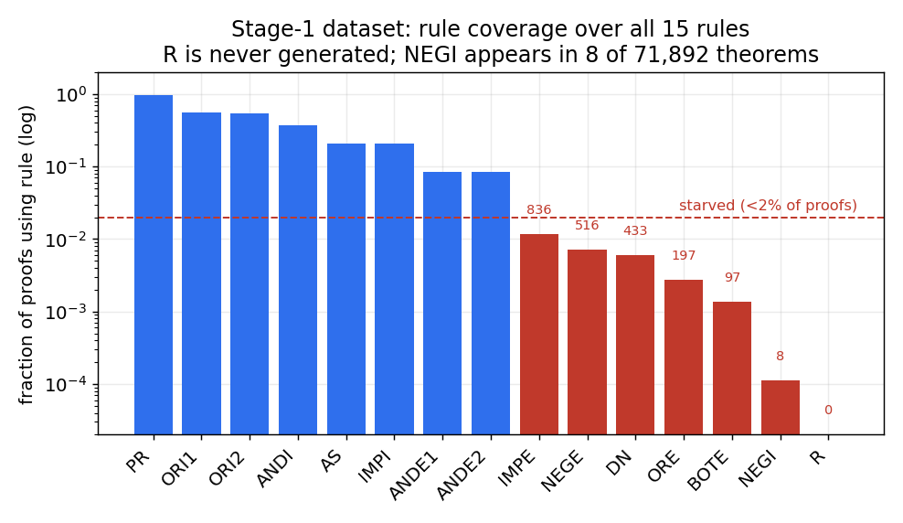
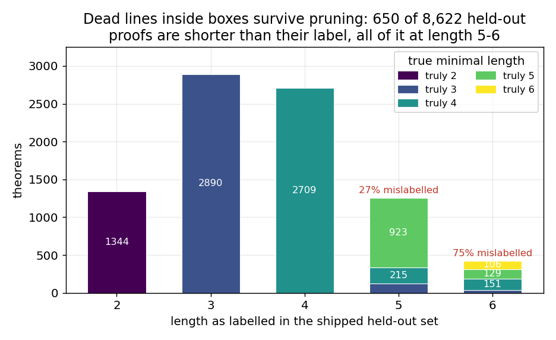
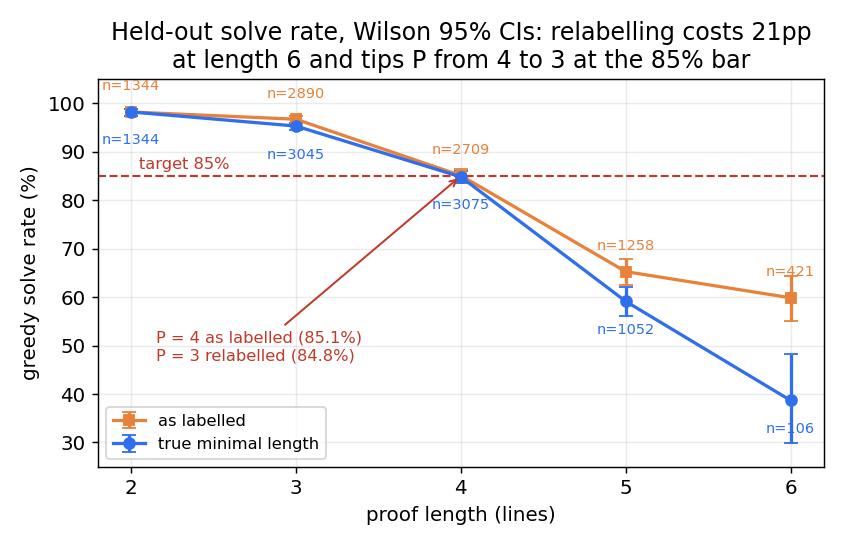

# Bootstrapping a natural-deduction prover past its training length

Sahil Paliwal · Stage 1 complete, Stage 2 not attempted · code: this repo · every
number below is reproduced by a command listed in [`numbers.md`](numbers.md).

---

## Executive summary

**The question.** How far past its pre-training length can RL push a
natural-deduction prover? The metric is `L − P`: `L` is the longest proof length
an RL-trained model still solves at a chosen accuracy, `P` the same for the
pre-trained model.

**The headline, stated plainly: I have P and I do not have L.** Stage 1 is
finished and clears the bar — **86.9%** greedy on 8,622 held-out theorems (95% CI
86.2–87.6%). **P = 3** at an 85% bar — the bar is my choice, set to the ≥85%
greedy reference point the brief names for this regime. The point estimate on the
shipped length labels is 4, but it clears the bar by 0.1 points (85.1% vs 85.0%);
the Wilson lower bound gives 3, and so does correcting the labelling bug in
finding 2.
**`L − P` is not measured** — Stage 2 was not attempted in the time available.
Rather than estimate it, §7 says exactly what I would run.

Three findings, in descending order of how much they would change what I did next:

- **The barrier is coverage, not model capacity.** The model scores 86.9%
  in-distribution and **16.7%** (2/12, CI 4.7–44.8%) on the curated ≤6-line
  validation theorems. My generator over-samples introduction rules that always
  fire and starves the goal-directed rules canonical theorems need: **`R` appears
  0 times** in 71,892 theorems, `NEGI` 8, `BOTE` 97, `ORE` 197 — against
  `ORI1`/`ORI2`/`ANDI` at 39k/39k/27k. The model learned the distribution it was
  handed, faithfully; that distribution has a hole exactly where it was tested.
  *(Figure 1)*

- **Pruning removes dead lines outside subproof boxes and misses the identical
  dead line inside one.** `effective_length` resolves a cited box to its whole
  index span, so `prune` calls a padded proof tight. **650 of 8,622** held-out
  proofs are shorter than their label — none at lengths 2–4, 27% at length 5, and
  **75% at length 6**, the length that defines P. Strict-pruning all 8,622 and
  re-verifying gives **0 failures**, so the removed lines were genuinely dead —
  and **the model already writes such lines in 1.6% of its accepted proofs**
  (117/7,493), so this is a live Stage-2 reward-hacking surface, present before
  any RL pressure has been applied. *(Figure 2)*

- **Length is one difficulty proxy and a weak one.** Relabelling by true minimal
  length drops the length-6 solve rate from **59.9% to 38.7%** — the Wilson
  intervals, [55.1, 64.4] and [30.0, 48.2], do not overlap — and tips P from 4 to
  3. Depth of nesting, premise shape and rule mix carry difficulty that line count
  does not. *(Figure 3)*

**Required test numbers**, run once on the final model with no tuning
(`score_test.py`): **test_short 31.5%** (84/267, CI 26.2–37.3%); **test_long
1.5%** (8/532, CI 0.8–2.9%). test_long is near-zero by construction — those
proofs exceed the 6-line cap the model was trained under, and closing that gap is
precisely Stage 2.

---

### Figure 1 — rule coverage is the barrier



Per-proof rule presence across the 71,892 distinct theorems, log scale, plotted
over all 15 rules rather than over the rules that happen to occur. Seven rules sit
below 2% of proofs; `R` is never generated at all. This is the single figure that
explains the 86.9% / 16.7% gap.

### Figure 2 — dead lines inside boxes survive pruning



Held-out theorems by shipped label, coloured by true minimal length after strict
pruning. Lengths 2–4 are clean. At length 6, only 106 of 421 theorems genuinely
need six lines.

### Figure 3 — solve rate, before and after relabelling



Greedy held-out solve rate with Wilson 95% intervals, under both labellings. The
curves are identical through length 4 and separate exactly where the padding is.

---

## 1. Setup and the metric that matters

The verifier checks **soundness, not relevance**. It accepts unused premises and
dead lines — lines that are derived but never cited on the way to the conclusion.
Because the headline metric is measured in *length*, that tolerance is a problem
in both stages: a padded 6-line training example may contain 3 real inference
steps, which flattens the difficulty gradient the model learns from; and in
Stage 2 an RL policy can append junk to *look* like it writes longer proofs.

`nd/effective_length.py` is the guard. It builds the citation DAG, reverse-traverses
from the final line, and counts only the lines that reach it. `emitted_length` is
what the verifier reports; `effective_length ≤ emitted_length`, and the gap is the
padding. Every proof in the dataset carries both.

`nd/formula.py` is the other foundation: it reuses the verifier's own
`parse_formula` so there is exactly one parser in the project, adds rendering, and
adds canonical atom renaming — `(P & Q) ⊢ P` and `(R & S) ⊢ R` are the same
theorem, and without collapsing them the train/held-out split leaks.

**Where this went wrong.** The metric has a blind spot I found only after the
model shipped, and it is finding 2 above: `_line_deps` resolves an `IMPI`/`NEGI`
box citation to the whole index span `s..e`, so every line between the assumption
and the box's end line counts as reachable whether or not it feeds anything. A
dead line at depth 0 is caught; the same dead line at depth 1 is invisible. The
docstring defends this as "citing a box means using the whole subproof", which is
a fair reading of the *citation* semantics and the wrong rule for *pruning* —
nothing stops you deleting an interior line the box's end line never used. §5
quantifies it; the fix is deferred to §7 so that `data/` stays byte-reproducible
from the commit that produced it.

## 2. Stage 1 — data generation

**Why forward.** A forward generator is sound by construction: it only ever fires
a rule whose inputs already exist, so no candidate needs a backward search to
justify it. Everything is still gated through `verify_text` — nothing else is
trusted.

**How it works.** Sample 1–3 premises with some structure (so the consuming rules
have something to fire on), then repeatedly apply a local rule whose inputs are
already present, until a target length in [2, 6] is reached, preferring consuming
rules over introducing ones so proofs make real inferences instead of ballooning
conjunctions. `IMPI` is inserted as one subproof — assume `A`, take a few local
steps, close to `(A > B)` — which is where all box depth comes from. `NEGI` and
`ORE` are built from parametric templates, because a random forward walk
essentially never stumbles into a valid reductio or case-analysis inside six
lines; those need a specific shape.

**Yield.** Seed 0, 20k attempts: 90% accepted, all 18,022 re-verify.

**A tokenisation gotcha worth recording.** My first rule-coverage counter reported
all 15 rules present. It was counting surface tokens, and the atom `R` renders as
the bare token `R` — the same token as the reiteration rule. Counting the parsed
`rule` field instead gives the true answer: **`R` is emitted 0 times**, because
`'R'` is listed in `LOCAL_RULES` but `_local_candidates` has no branch that
produces it. The bug that hid the coverage barrier was a token collision in a
diagnostic, not in the model.

## 3. Stage 1 — pruning and the dataset pipeline

Proofs with dead lines are not discarded — the reachable core is usually a
perfectly good shorter proof — so `nd/prune.py` trims each one to that core,
drops premises no longer cited, renumbers, re-renders, and re-verifies, falling
back to the original string if anything fails to verify. Validated on 13.5k
generated proofs: 57.7% needed tightening, 0 re-verify failures. (The "0 still
padded afterwards" I recorded at the time was measured with the metric that has
the blind spot — see §5.)

The pipeline is split so the logic is testable independently of I/O:

- **`nd/dataset.py`** — prune, drop degenerate theorems, drop anything matching
  `validation_36` or a renaming of it, dedup to the shortest proof per prompt,
  then split theorem-disjointly. Two keys do this: a renaming-invariant key for
  dedup, and a renaming- *and* premise-order-invariant key for the split, so no
  theorem can leak across the split by relabelling or reordering its premises.
  Hashing is `hashlib`, not Python's salted `hash()`, so the split reproduces.
- **`scripts/gen_data.py`** — sampling and I/O only, with long-bias alternation
  (half the attempts target length 5–6) because pruning collapses many proofs to
  length 2 and length 6 is what defines P.
- **`scripts/check_dataset.py`** — an independent re-check of the finished files:
  every proof verifies for its exact sequent, ≤6 lines, tight, `prompt + proof`
  reconstructs `text`, splits disjoint, no validation overlap.

**Run (300,000 attempts, seed 0, 48s):** pool 284,320 accepted; 62% of them
padded; dropped 4,133 degenerate and 25,984 validation-matching; 71,892 distinct
theorems → **63,270 train / 8,622 held-out**, overlap 0, leakage 0.

On the 25,984 dropped as validation matches: this is real evidence that the
generator's distribution overlaps the curated one, but weaker than it looks. Only
12 of the 36 validation sequents are ≤6 lines, so a 6-line-capped generator can
only ever hit those 12 — around 2,000 rediscoveries each. It says the generator
reliably finds the canonical *short* theorems; it says nothing about the 24 that
matter for Stage 2, and it partly reflects how concentrated the generator is on a
narrow set of shapes.

## 4. Stage 1 — tokenizer, model, training, evaluation

- **`nd/tokenizer.py`** — one token per whitespace-separated symbol; vocabulary
  101. `N1`–`N64` are atomic, so citing a line is a single decision rather than a
  digit-by-digit spelling task. Round-trip over all 71,892 examples: 0 mismatches;
  max sequence length 193 < block size 256.
- **`nd/model.py`** — pre-norm decoder-only transformer, 4 layers, width 256,
  8 heads, weight-tied head: **3.251M parameters**, matched to the reference size
  so the numbers are comparable.
- **`nd/train.py`** — AdamW (β = 0.9/0.95, weight decay 0.1 on matrices only,
  none on biases or norms), peak LR **3e-4** with a 200-step linear warmup then
  cosine decay to **3e-5**, **dropout 0.1**, gradient-norm clipping at 1.0. The
  warmup-then-decay shape is what keeps training from diverging early or
  thrashing late. **Prompt-masked loss**: error is scored only on the proof body,
  since the prompt is given at test time and capacity spent predicting it is
  wasted. A greedy held-out probe runs every 500 steps, so the run is monitored by
  the quantity of interest rather than by loss. 4000 steps, batch 128, seed 0,
  65 minutes on Apple MPS (~0.75s/step).
- **`nd/eval.py`** — prompts are grouped so every batch holds sequences of equal
  length, which removes padding entirely and keeps position indices honest.
  Greedy decoding is the headline because it is deterministic and has nothing to
  tune. Wilson intervals throughout, because the per-length buckets are small
  (421 theorems at length 6) and a bare percentage there is noise.

**One diagnostic worth keeping.** At step 500 the loss was 0.54 and the held-out
solve rate 0.1%. That looked like a broken evaluation. It was not: the raw greedy
output was well-formed, and the failures were systematic — the model was not yet
copying premise formulas verbatim into the `PR` lines, and was not steering to the
exact requested conclusion. Both are in-context copy/align behaviour that arrives
as a phase transition. The probe trace confirmed it: 0.1% → 36.9% → 54.9% → 65.6%
→ 72.8% → 74.8% → 78.9% → 80.6%. The right call was to wait rather than tune
blind.

## 5. Results

| | value | 95% CI |
|---|---|---|
| Held-out, greedy | **86.9%** (7,493/8,622) | 86.2–87.6% |
| …by labelled length 2 / 3 / 4 / 5 / 6 | 98.2 / 96.7 / 85.1 / 65.3 / **59.9%** | |
| …by true minimal length 2 / 3 / 4 / 5 / 6 | 98.2 / 95.3 / 84.8 / 59.1 / **38.7%** | |
| **P** (85% bar) | **3** | 4 on labelled point estimate, by 0.1pp |
| `validation_36`, ≤6 bin | 16.7% (2/12) | 4.7–44.8% |
| `validation_36`, overall | 5.6% (2/36) | 24/36 need >6 lines |
| test_short (one-shot) | 31.5% (84/267) | 26.2–37.3% |
| test_long (one-shot) | 1.5% (8/532) | 0.8–2.9% |
| **`L − P`** | **not measured** | Stage 2 not attempted |

Failures are semantic, not truncation. Counting rejected attempts by the rule the
offending line *claimed* — the line named that rule and did not follow from its
cited lines by it — the tally is `ANDI` 529, `ORI1` 206, `ORI2` 134, `ANDE1` 91,
`IMPI` 45, `ANDE2` 44, `IMPE` 17. Only 48 attempts ended on a formula that was not
the requested conclusion and 3 misquoted the premise block; no attempt was
truncated.

**The box-padding audit** (`scripts/audit_box_padding.py`, Figures 2–3). Under
strict box semantics — a cited box contributes its assumption line, its end line,
and the end line's transitive citations, nothing else — the shipped data is not
tight: 4,738 of 13,336 boxed training proofs carry dead interior lines (35.5%;
7.5% of all 63,270 examples), and 650 of 8,622 held-out proofs. Strict-pruning
every held-out proof and re-verifying gives **0 failures**. A worked case:

```
labelled 6:  N1 ( ( R > R ) & Q ) : PR ;  N2 S : PR ;  N3 | S : AS ;
             N4 | Q : ANDE2 N1 ;  N5 | ( S v P ) : ORI1 N2 ;  N6 … : IMPI N3 N5 ;
really 4:    N1 S : PR ;  N2 | S : AS ;  N3 | ( S v P ) : ORI1 N1 ;  N4 … : IMPI N2 N3 ;
```

The model has already picked the habit up: 117 of its 7,493 accepted proofs
(1.6%) contain dead interior lines, and its accepted 6-line outputs fall from 58
to 42 under strict pruning — reward hacking present at low rate before any RL
pressure has been applied.

## 6. Limitations

**The 16.7% on curated theorems is a real generalisation failure.** I want to be
exact about that rather than soften it: the model does not transfer from its own
distribution to a logician's. What follows is the mechanism, not an excuse.

My forward generator builds proofs by piling structure up — `ANDI` and `ORI`
dominate because their inputs are always available and they always fire. Textbook
theorems go the other way: they consume structure and discharge assumptions, via
modus-ponens chains, reductio, and reiteration. Figure 1 shows those are exactly
the rules the corpus starves. `positive_paradox` (`Q ⊢ (P > Q)`) and absorption
need `R`, which the corpus contains zero times, so they are unreachable by
construction; `modus_tollens`, `negative_paradox` and `consequentia_mirabilis`
need goal-directed `NEGI`/`BOTE` chains the generator barely produces. **This
model can prove almost anything its generator would have written and almost
nothing a logician would have written** — which is a statement about the training
data, not about 3.25M parameters. The confidence interval on 2/12 is 4.7–44.8%,
so the point estimate is soft; the mechanism behind it is not.

**Length is a thin difficulty axis.** Even with the labelling corrected, line
count ignores nesting depth, premise structure and rule mix. Every proof in this
dataset has box depth at most 1, because `gen_impi` inserts exactly one subproof
and never recurses. A length-6 proof with two nested boxes is a different problem
from a length-6 flat walk, and my dataset contains none of the former.

**The dataset is not tight**, per §5, and `check_dataset.py`'s tightness assertion
inherits the same blind spot, so it certified a property that does not hold.

**Stage 2 was not attempted**, so the number this take-home is actually about is
absent. Everything above is the pre-training baseline it would have been measured
against.

## 7. What I'd do with another week

1. **Ship the rebalanced generator under a controlled comparison.**
   `nd/generator_templates.py` already exists — 8 goal-directed template families
   (modus ponens, modus tollens, hypothetical syllogism, weakening, negative
   paradox, explosion, DN intro/elim) that inject `R`, `IMPE`, `NEGE`, `NEGI`,
   `BOTE`, with depth-1/2 formula arguments so they survive dedup instead of
   collapsing to a handful of theorems. A 400k-attempt run moved the *distinct*
   histogram to `IMPE` 14.7k, `NEGE` 9.5k, `BOTE` 6.0k, `NEGI` 3.2k, `R` 3.0k. I
   stopped the retrain mid-flight to ship a known-good model, so it is untested.
   The experiment is: same architecture, same steps, same seed, two datasets,
   compare held-out *and* `validation_36` ≤6. My prediction is held-out drops a
   few points and the ≤6 bin moves substantially — if it does not, coverage was
   not the barrier and I was wrong.
2. **Fix `_line_deps`** so a box contributes `[s, e]` (and ORE `[j, s1, e1, s2, e2]`),
   letting the existing traversal pull in what the end line genuinely cites;
   re-prune, regenerate, and re-measure tightness and the by-length curve. I have
   run the strict variant over all 8,622 held-out proofs with 0 re-verify
   failures; I have not regenerated the dataset under it.
3. **Add a second difficulty axis** — nested boxes (depth ≥ 2) and richer premise
   shapes — so "length 6" stops being a single shape.
4. **Then Stage 2**, with the pieces the brief requires and not before: a frozen
   Stage-1 control on the same sample budget, a transfer set RL never samples, a
   found-proof-length histogram per round scored in *strict* effective length, and
   in-distribution tracking each round. The frontier claim is the longest length
   with ≥5 distinct verified proofs — measured on what the model *wrote*, not on
   what the target was labelled.

## 8. Conclusion

This exercise produced a clean Stage 1 that clears the in-distribution bar, and
two failures that are worth more than the score.

The first is a coverage hole in the generator: the model is excellent on the
distribution it was given and poor on the one it was tested against, and the rule
histogram says why. That is a concrete instance of the confound this whole project
exists to escape. In a fully-specified sandbox — where I can enumerate all 15
rules and count how often each was seen — I can attribute the failure to the
training distribution rather than to model capability. At frontier scale you
cannot make that attribution, which is exactly why the sandbox is worth having.

The second is a padding blind spot inside subproof boxes: a soundness-checking
verifier plus a reachability metric that trusts box spans produces a dataset that
certifies itself as tight while 7.5% of it is not. Stage 2 would have walked
straight into it — the reward signal would have paid for lines that do no work,
inside boxes, where the metric cannot see them, and the model already writes such
lines 1.6% of the time unprompted.

Both point the same way. Before you can measure how far RL pushes a model past its
training data, you have to be sure the training data is what you think it is, and
that "length" means what you think it means. I could not have claimed either here
without checking, and one of the two checks I only ran after the model shipped.

## 9. Notes

**Time and scope.** Built across 2026-09-02 and 2026-09-03, roughly 8
hours of work; Stage 2 was out of scope in that window. A dated work log with the
dead ends included is in [`log.md`](log.md).

**Decode-budget bug (worth 11 points).** The first full evaluation returned 75.8%
and P = 3, with a failure tally full of parse errors — `eof in formula`, missing
`)`, missing `QED`. Parse errors from a model that had been writing well-formed
proofs were the tell. Gold length-6 bodies run to 154 tokens and length-5 to 125;
I was decoding 80 new tokens, so **1,411 held-out proofs could not physically
finish**. Raising `max_new_tokens` 80 → 176 (prompt + body still under the 256
block size) took the same checkpoint, with no retraining, from 75.8% to **86.9%**.
Reporting the truncated number would have understated the model by 11 points and
sent me tuning the wrong thing.

**Disclosure of AI-assistant use.** A coding agent (Claude Code) wrote most of the
code in `nd/` and `scripts/` and ran the measurements. The research judgment is
mine: what to generate and why forward, what to measure, what to believe, which
checkpoint to ship, and which results to distrust. The box-padding finding came
from asking the agent to attack its own output — it had already logged the
pipeline as leaving "0 still padded" (`log.md`, 2026-09-02), and the audit I asked
for on the hunch that "a box is a complete structure" was being taken too
literally contradicted that claim. This document is my structure and my argument;
I used the agent to draft prose against it and to check every number, and each one
is traceable to a command in `numbers.md`.

**Reproducing.** `data/` and `ckpt/stage1.pt` come from the template-free
generator at commit `268e468`; `scripts/gen_data.py --n 300000 --seed 0`
reproduces the dataset exactly. `nd/generator_templates.py` is the rebalance
exploration and was **not** used for the shipped model. Full commands, seeds and
wall-clock are in [`README.md`](README.md); the original brief is preserved in
[`BRIEF.md`](BRIEF.md).
